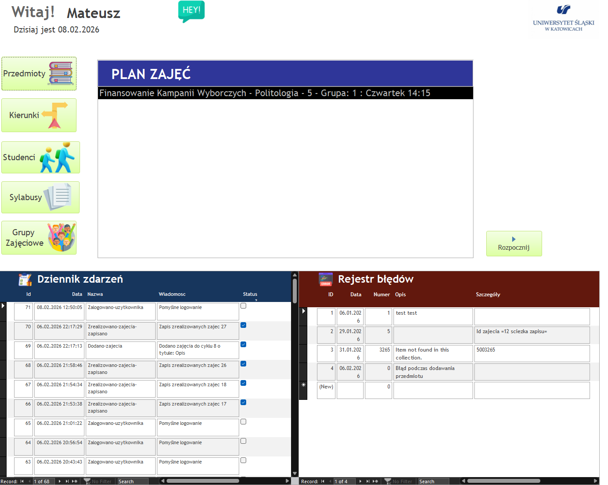
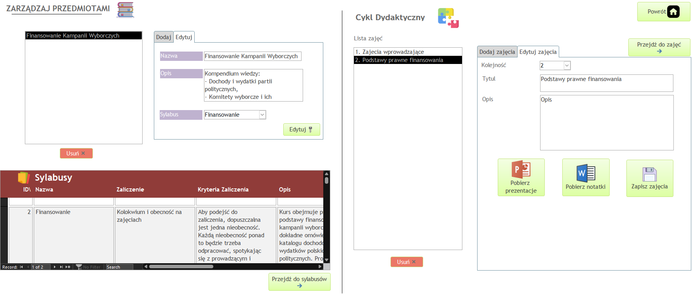
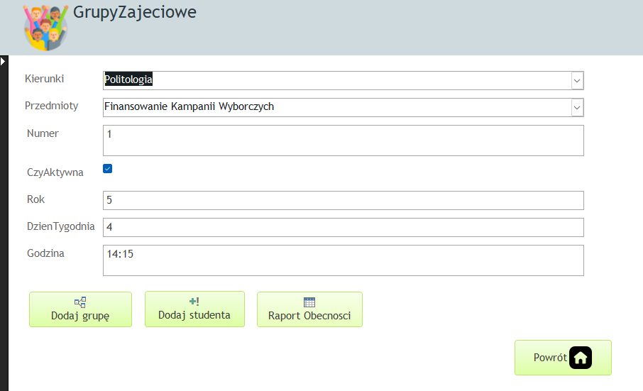
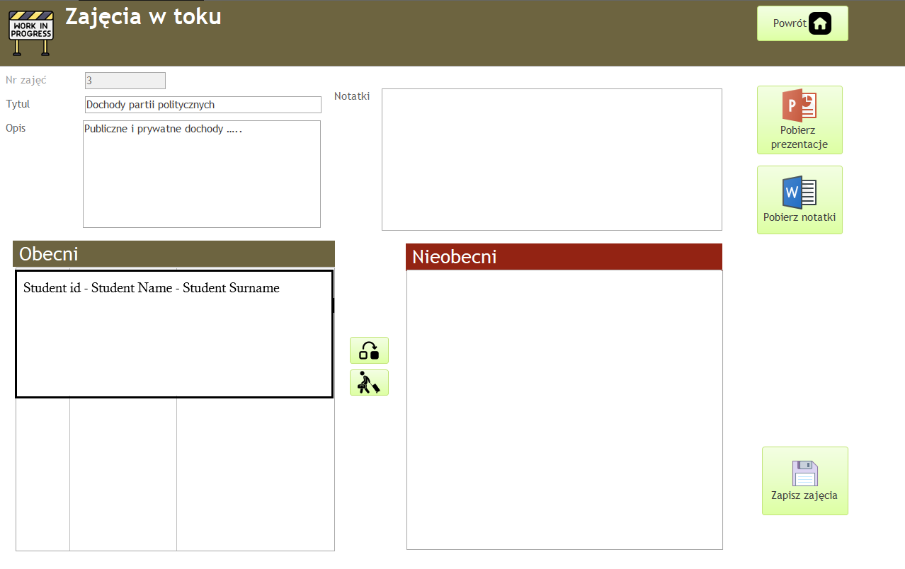
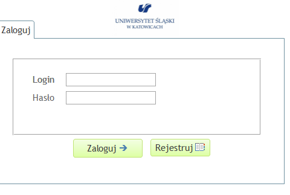
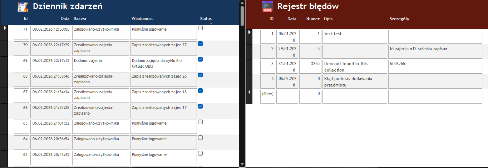
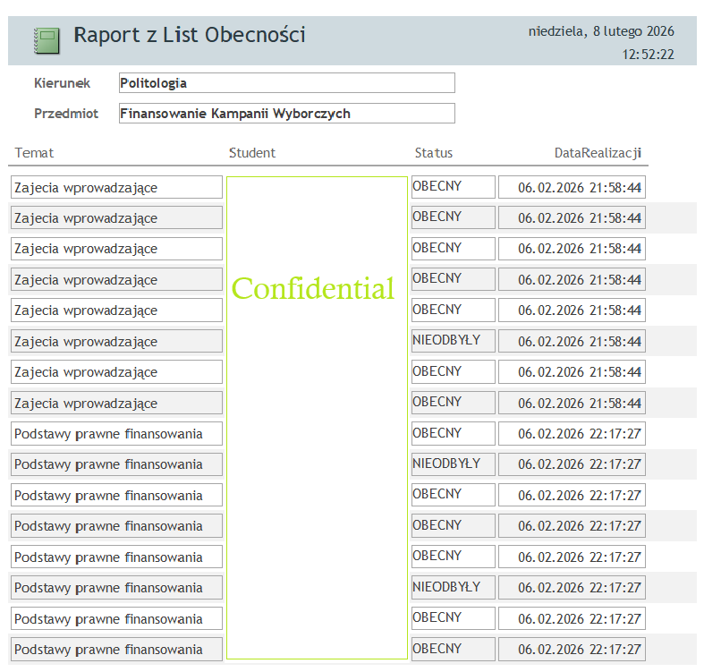

# Przybornik Pracownika Uniwersytetu

## 📋 Opis Projektu

**Przybornik Pracownika** to aplikacja MVP oparta na Microsoft Access przeznaczona dla pracowników uniwersytetu. Umożliwia kompleksowe zarządzanie procesem dydaktycznym, od organizacji kierunków i przedmiotów, poprzez planowanie zajęć, aż do rejestracji obecności studentów.

Aplikacja wspiera pełny cykl życia zajęć akademickich z możliwością raportowania i analizy danych.

---

## 🎯 Główne Funkcjonalności

### 1. **Zarządzanie Strukturą Akademicką**
- ✅ Dodawanie i edycja kierunków studiów
- ✅ Zarządzanie przedmiotami
- ✅ Przypisywanie przedmiotów do cykli dydaktycznych (semestrów, cykli nauczania)
- ✅ Tworzenie zajęć w ramach cyklu dydaktycznego


### 2. **Organizacja Zajęć**
- ✅ Dodawanie opisów, tytułów i ustalanie kolejności zajęć
- ✅ Przypisywanie materiałów do zajęć:
  - 📁 Pliki prezentacji
  - 📝 Notatki
  - 📄 Opisy zajęć
- ✅ Tworzenie grup zajęciowych
- ✅ Powiązanie studentów z grupami zajęciowymi



### 3. **Zarządzanie Studentami**
- ✅ Ręczne dodawanie studentów
- ✅ **Import masowy z plików Excel**
- ✅ Przypisywanie do grup zajęciowych
- ✅ Przeglądanie listy studentów per grupa

### 4. **Prowadzenie Zajęć**
- ✅ Widok harmonogramu zajęć na Landing Page
- ✅ Rozpoczęcie zajęć z widokiem
- ✅ **Rejestracja obecności** - sprawdzanie obecności studentów
- ✅ Pobieranie materiałów (prezentacji) podczas zajęć
- ✅ Status rzeczywisty zajęć (zapłanowane, trwające, zakończone)


### 5. **Autentykacja i Bezpieczeństwo**
- ✅ System logowania dla pracowników
- ✅ Weryfikacja hasła z wykorzystaniem **SHA-256 z SALTem**
- ✅ Przechowywanie bezpieczne poświadczeń


### 6. **Logging i Monitoring**
- ✅ **Event Logging** - logowanie zdarzeń w systemie do dedykowanej tabeli
- ✅ **Event Dispatcher** - gotowy do rozszerzenia dla obsługi nowych typów zdarzeń
- ✅ **Error Journal** - dziennik błędów aplikacji
- ✅ Przeglądanie logów na Landing View


### 7. **Raportowanie**
- ✅ Generowanie listy zajęć per grupa
- ✅ Generowanie raportu obecności:
  - Studenci w grupie
  - Status obecności na każdych zajęciach
  - Historia obecności
  


### 8. **Landing Page (Dashboard)**
- ✅ Przegląd harmonogramu aktywnych zajęć
- ✅ Szybki dostęp do najbliższych przedmiotów
- ✅ Przeglądanie logów zdarzeń i błędów
- ✅ Przycisk do rozpoczęcia zajęć

---

## 🏗️ Architektura

### Struktura Projektu

```
PrzybornikPracownika/
├── Uniwersytet.accdb              # Główna baza danych
├── Uniwersytet_Backup.accdb       # Kopia zapasowa
├── Resources/                      # Zasoby aplikacji
├── VBA/                            # Kod VBA
│   ├── AccessObjects/              # Formularze (Views)
│   │   ├── Form_LoginView.cls
│   │   ├── Form_LandingView.cls
│   │   ├── Form_KierunkiView.cls
│   │   ├── Form_PrzedmiotyView.cls
│   │   ├── Form_ZajeciaView.cls
│   │   ├── Form_DodajGrupeView.cls
│   │   ├── Form_GrupyZajecioweView.cls
│   │   ├── Form_RozpocznijZajeciaView.cls
│   │   ├── Form_StudenciView.cls
│   │   ├── Form_SylabusyView.cls
│   │   ├── Form_EventDIspatcher.cls
│   ├── ClassModules/               # Klasy (serwisy i modele)
│   │   ├── AppContext.cls          # Kontekst aplikacji
│   │   ├── CryptoService.cls       # Szyfrowanie i haszowanie
│   │   ├── FileRepository.cls      # Zarządzanie plikami
│   │   ├── IEntityMapper.cls       # Interfejs mapowania encji
│   │   ├── User.cls                # Model użytkownika
│   │   ├── UserMapper.cls          # Mapowanie użytkownika z DB
│   └── Modules/                    # Moduły (funkcje globalne)
│       ├── AutoExec.bas            # Punkt wejścia aplikacji
│       ├── Program.bas             # Inicjalizacja programu
│       ├── Consts.bas              # Stałe aplikacji
│       ├── Dtos.bas                # Data Transfer Objects
│       ├── EventMdl.bas            # Moduł zdarzeń
│       ├── FileRepo.bas            # Repozytorium plików
│       ├── GitHelperService.bas    # Integracja z Git
│       ├── LandingInitializationService.bas  # Inicjalizacja Landing Page
│       ├── Logger.bas              # System logowania
│       ├── SqlStringService.bas    # Budowanie zapytań SQL
│       └── Utilities.bas           # Funkcje pomocnicze
```

### Technologia

- **Backend**: Microsoft Access VBA (Visual Basic for Applications)
- **Baza Danych**: Access Database (.accdb) - relacyjna
- **Bezpieczeństwo**: SHA-256 z SALTem
- **Architektura**: MVC-like pattern z formularze jako Views, klasy jako serwisy

---

## 📊 Model Danych

### Główne Tabele

| Tabela | Opis |
|--------|------|
| **Users** | Pracownicy/Wykładowcy z hasłami |
| **Kierunki** | Kierunki studiów |
| **Przedmioty** | Przedmioty nauczane |
| **CyklaDydaktyczne** | Cykle/semestry nauczania |
| **Zajecia** | Zaplanowane zajęcia |
| **Studenci** | Baza studentów |
| **GrupyZajeciowe** | Grupy studentów na zajęciach |
| **Presence** | Rejestracja obecności |
| **Events** | Log zdarzeń systemowych |
| **ErrorLog** | Dziennik błędów |
| **Materials** | Materiały do zajęć (prezentacje, notatki) |

---

## 🔑 Komponenty Kluczowe

### 1. **AppContext** - Kontekst Aplikacji
```vba
Public CurrentUser As User
Public db As Database
```
Przechowuje bieżącego użytkownika i referencję do bazy danych.

### 2. **CryptoService** - Szyfrowanie
- `HashPassword(password)` - Haszuje hasło z losowym SALTem w formacie "SHA256:salt:hash"
- `VerifyPassword(inputPassword, storedValue)` - Weryfikuje hasło
- `Sha256Hash(text)` - Oblicza hash SHA-256

### 3. **FileRepository** - Zarządzanie Plikami
Obsługa przechowywania i pobierania materiałów dydaktycznych (prezentacje, notatki).

### 4. **UserMapper** - Mapowanie Encji
Konwertuje dane z bazy danych do obiektów użytkownika.

### 5. **Logger** - System Logowania
- Loguje zdarzenia do tabeli Events
- Loguje błędy do tabeli ErrorLog
- Integracja z Event Dispatcher

### 6. **Event Dispatcher** - Obsługa Zdarzeń
Gotowy do implementacji obsługi różnych typów zdarzeń systemowych (login, dodanie studentów, zmiana obecności itp.).

---

## 👁️ Widoki (Forms/Views)

### 1. **LoginView** 
Formularz logowania - weryfikacja użytkownika poprzez:
- Sprawdzenie nazwy użytkownika
- Weryfikacja hasła (SHA-256)
- Inicjalizacja AppContext

### 2. **LandingView** (Dashboard)
- Harmonogram zajęć na dziś/tydzień
- Przycisk "Rozpocznij zajęcia"
- Przeglądanie logów zdarzeń
- Przeglądanie dziennika błędów
- Szybkie akcje (dodaj grupę, dodaj przedmiot)

### 3. **KierunkiView**
- Lista wszystkich kierunków
- Dodawanie nowych kierunków
- Edycja i usuwanie kierunków

### 4. **PrzedmiotyView**
- Przeglądanie przedmiotów
- Przypisywanie do kierunków
- Zarządzanie sylabusem

### 5. **ZajeciaView**
- Zarządzanie zajęciami
- Przypisywanie materiałów
- Ustawianie kolejności zajęć
- Edycja opisów

### 6. **DodajGrupeView**
- Tworzenie nowych grup zajęciowych
- Wybór przedmiotu i cyklu dydaktycznego
- Przypisanie prowadzącego

### 7. **GrupyZajecioweView**
- Lista grup zajęciowych
- Zarządzanie członkami grupy
- Przeglądanie szczegółów grupy

### 8. **RozpocznijZajeciaView**
- Interface prowadzenia zajęć
- Rejestracja obecności (checkboxy dla każdego studenta)
- Pobieranie materiałów
- Kończenie zajęć

### 9. **StudenciView**
- Przeglądanie listy studentów
- Import z Excela (masowy upload)
- Edycja danych studenta
- Przypisanie do grup

### 10. **SylabusyView**
- Przeglądanie sylabusów przedmiotów
- Edycja treści sylabusu

### 11. **EventDispatcher**
- Przeglądanie zarejestrowanych obsług zdarzeń
- Konfiguracja listenerów zdarzeń

---

## 🚀 Instrukcja Użytkowania

### Pierwsza Sesja

1. **Otwarcie Aplikacji**
   - Uruchom plik `Uniwersytet.accdb`
   - Aplikacja automatycznie uruchomi `AutoExec.bas`

2. **Logowanie**
   - Zaloguj się na konto pracownika
   - System weryfikuje hasło przy użyciu SHA-256

3. **Ustawienie Struktury Akademickiej**
   - Przejdź do `KierunkiView` - dodaj kierunki
   - Przejdź do `PrzedmiotyView` - dodaj przedmioty
   - Przypisz przedmioty do kierunków

4. **Konfiguracja Cyklu Dydaktycznego**
   - Utwórz cykl dydaktyczny (semestr/rok akademicki)
   - Przypisz przedmioty do cyklu

### Zarządzanie Zajęciami

5. **Tworzenie Zajęć**
   - Przejdź do `ZajeciaView`
   - Dodaj zajęcia dla przedmiotu
   - Przypisz materiały (prezentacje, notatki)
   - Ustaw opis i kolejność

6. **Tworzenie Grupy Zajęciowej**
   - Kliknij "Nowa grupa" w `DodajGrupeView`
   - Wybierz przedmiot i cykl
   - Utwórz grupę

### Zarządzanie Studentami

7. **Dodawanie Studentów**
   - **Masowo**: Przejdź do `StudenciView` → Import z Excela
   - **Indywidualnie**: Dodaj studenta ręcznie
   - Przypisz do grupy zajęciowej

### Prowadzenie Zajęć

8. **Rozpoczęcie Zajęć**
   - Przejdź do `LandingView` (Dashboard)
   - Kliknij "Rozpocznij zajęcia" przy wybranym zajęciu
   - Otwiera się `RozpocznijZajeciaView`

9. **Rejestracja Obecności**
   - Zaznacz obecnych studentów
   - System automatycznie zapisuje do tabeli `Presence`

10. **Pobieranie Materiałów**
    - Studenci mogą pobierać prezentacje i notatki
    - Materiały przechowywane w `FileRepository`

### Raportowanie

11. **Generowanie Raportów**
    - **Raport zajęć**: Lista zajęć per grupa
    - **Raport obecności**: Historia obecności per grupa
    - Eksport do formatu PDF/Excel

---

## 🔐 Bezpieczeństwo

### Hasła
- Haszowane SHA-256 + losowy SALT (16 znaków)
- Format: `SHA256:salt:hash`
- Weryfikacja podczas logowania

### Uprawnienia
- Dostęp zróżnicowany dla różnych ról (w przygotowaniu)

### Logging
- Wszystkie zdarzenia rejestrowane w tabeli `Events`
- Błędy zapisywane w tabeli `ErrorLog`
- Możliwość przeglądu w `LandingView`

---


## 🛠️ Rozszerzenia i Możliwości Przyszłościowe

1. **Event Dispatcher** - Aktualnie implementacja jest gotowa do rozszerzeń
   - Dodanie obsługi zdarzeń: "Student dodany", "Zajęcia rozpoczęte", "Obecność zmieniona"
   - Wysyłanie notyfikacji
   - Automatyczne raporty

2. **Zaawansowana Analityka**
   - Statystyki obecności
   - Raport wydajności studentów
   - Predykcja trudności w przedmiocie

3. **Integracja z Systemami Zewnętrznymi**
   - Synchronizacja z Active Directory
   - Eksport do systemów zarządzania uczelną
   - API do aplikacji mobilnych

4. **Ulepsz UI**
   - Nowoczesny interfejs (mogłoby być w formie webowej)
   - Responsywny design
   - Tematy kolorystyczne

5. **Export/Raportowanie**
   - Export raportów do Word, Excel, PDF
   - Automatyczne raporty na mail
   - Harmonogramy drukowane

---

## 📦 Techniczne Szczegóły

### Wymagania
- Microsoft Access 2010 lub nowsza
- .NET Framework (opcjonalnie, dla zaawansowanych kryptowalib)
- Excel 2010+ (opcjonalnie, do importu studentów)

### Lokalizacja Plików
- Główna baza: `Uniwersytet.accdb`
- Kopia zapasowa: `Uniwersytet_Backup.accdb`
- Zasoby: folder `Resources/`
- Kod VBA: folder `VBA/`

### Git
- Projekt jest załadowany w Git
- Helper Service dostępny w `GitHelperService.bas`
- Możliwość commitowania zmian bezpośrednio z aplikacji

---

## 📞 Wsparcie i Kontakt

### Debugging
- Włącz pełne logowanie w `Logger.bas`
- Sprawdź dziennik błędów w `LandingView`
- Przeglądaj tabelę `Events` do analizy zdarzeń

### Problemy
- Sprawdź format hasła: `SHA256:salt:hash`
- Upewnij się, że baza danych nie jest otwarta w innym oknie
- Zresetuj `AppContext` poprzez ponowne zalogowanie

---

## 📝 Notatki Dla Deweloperów

### Konwencje Kodu
- Formularze: `Form_<NazwaView>.cls`
- Klasy: `<NazwaService>.cls`
- Moduły: `<NazwaModulu>.bas`
- Interfejsy: `I<NazwaInterfejsu>.cls`

### Używane Pattery
- **MVC**: Formularze jako Views, klasy jako Models i Controllers
- **Singleton**: AppContext przechowuje stan aplikacji
- **Repository**: FileRepository i UserMapper
- **Observer**: Event Dispatcher

### Testowanie
- Baza testowa: `Uniwersytet_Backup.accdb`
- Użyj do testów bez ryzyka utraty danych

---

**Wersja dokumentacji**: 1.0  
**Data aktualizacji**: 2026  
**Status**: MVP - Production Ready

---

*Dokumentacja projektu Przybornik Pracownika Uniwersytetu - Wszelkie prawa zastrzeżone*
